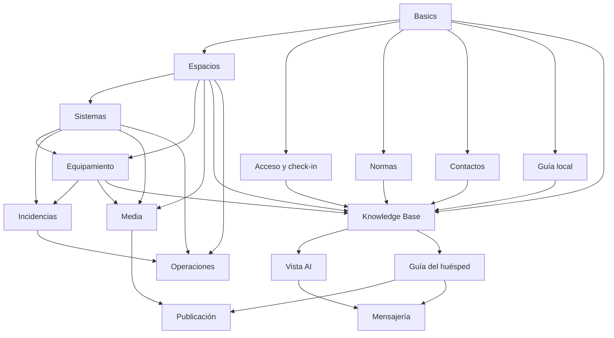

# WORKSPACE_INFORMATION_ARCHITECTURE

Versión: 2026-04-14  
Idioma visible: es-ES  
IDs internos: inglés  
Unidades: sistema métrico  

## Resumen ejecutivo

El workspace actual mezcla captura, operaciones y outputs en una lista plana. Eso introduce fricción (P7) porque el operador no sigue una secuencia natural, y porque módulos como **Equipamiento** dependen de **Espacios** y **Sistemas**, pero la IA no (ni la UI) lo refleja.

La arquitectura propuesta organiza el workspace por **fases mentales** (Setup → Operaciones → Outputs → Gestión), añade una sección explícita de **Sistemas** (para resolver P3), y define relaciones claras Espacios ↔ Equipamiento (para resolver P4 sin duplicar captura). Todo funciona con gating declarativo en config: cada sección declara `dependsOn` y `availabilityRules` (motor condicional unificado), y el sidebar se adapta a la propiedad.

## Lista ordenada de secciones

### Setup (captura estructural)

1. Overview / Resumen  
2. Propiedad (Basics)  
3. Espacios  
4. Sistemas *(nuevo)*  
5. Equipamiento (Amenities)  
6. Acceso y check-in  
7. Normas  
8. Contactos  
9. Media  

### Operaciones

10. Incidencias (Troubleshooting)  
11. Operaciones (Cleaning & Ops)  
12. Guía local  

### Outputs

13. Guía del huésped  
14. Vista AI  
15. Mensajería  
16. Publicación  

### Gestión

17. Knowledge Base  
18. Analíticas  
19. Configuración  
20. Registro de actividad

> Si queréis mantener exactamente 19 items, fusionad “Knowledge Base” dentro de “Vista AI” como pestaña, porque conceptualmente es el input/estado del asistente.

## Justificación del orden

- Basics es **raíz**: define propertyType/roomType/layoutKey/environment; filtra todo.
- Espacios temprano: fija inventario físico (camas, baños) y evita que Equipamiento se convierta en ruido sin ubicación.
- Sistemas antes de Equipamiento: WiFi, calefacción, AC, ascensor y agua caliente se configuran como Systems, y se reflejan como amenities derivadas (single source of truth).
- Arrival después: mejora guía del huésped, pero no bloquea inventario.
- Media en Setup: es gating habitual de publicación y un input fuerte para outputs.

## Definición completa por sección

### Overview / Resumen

Propósito: visión de estado + control tower.  
Captura: no captura datos; solo muestra agregados y CTA.  
Dependencias: todas (solo lectura).  
Outputs: “completeness”, warnings, preview de guía, estado de publicación.

### Propiedad (Basics)

Propósito: establecer contexto global.  
Captura: tipo, entorno, ubicación, capacidad target, flags base, horarios base si no están en Arrival, y configuración mínima.  
Dependencias: ninguna.  
Outputs: contexto para filtros en todas las taxonomías y forzado de consistencia (ej. layout → espacios derivados).

### Espacios

Propósito: inventario de estancias (canónico) + camas + features.  
Captura: `Space` + `BedConfiguration` + notas (+ visibilidad).  
Dependencias: Basics (roomType/layoutKey/bedroomsCount/bathroomsCount).  
Outputs: capacidad por camas, derivación de algunos amenities, y base para coverage de sistemas.

### Sistemas *(nuevo)*

Propósito: modelar infraestructura/servicios con herencia y cobertura por espacio.  
Captura: `PropertySystem` + `PropertySystemCoverage` (y subtypes).  
Dependencias: Basics + Espacios (para lista de espacios).  
Outputs: amenities derivadas (wifi/heating/cooling/hot_water/elevator), playbooks vinculables y mejor troubleshooting.

### Equipamiento (Amenities)

Propósito: inventario instanciable + experiencias ubicables.  
Captura: `PropertyAmenityInstance` + placements + instrucciones (guest/AI/internal).  
Dependencias: Espacios (placements), Sistemas (derivados), Normas (preconditions como niños/mascotas).  
Outputs: export OTA de amenities, contenido estructurado para guía.

### Acceso y check-in

Propósito: llegada, acceso y seguridad de credenciales.  
Captura: métodos de acceso, building access, parking y accesibilidad; check-in/out hours.  
Dependencias: Basics (hasBuildingAccess, propertyType), Contactos (opcional para “quién entrega”).  
Outputs: guía de llegada; credenciales como secretos en vault (via `SecretReference`) si aplica.

### Contactos

Propósito: red de soporte operativa y guest-facing (si aplica).  
Captura: `Contact` con visibilidad.  
Dependencias: ninguna (pero sugiere después de Arrival).  
Outputs: escalaciones en troubleshooting, operación y atención al huésped.

### Normas

Propósito: reglas clave y parámetros exportables.  
Captura: `policiesJson` + dynamic rules.  
Dependencias: Basics (propertyType/roomType), Equipamiento (algunas condiciones “si hay pets”).  
Outputs: secciones de guía + export OTA.

### Incidencias (Troubleshooting)

Propósito: biblioteca de playbooks (no tickets) y su vinculación a sistemas/amenities/espacios.  
Captura: `TroubleshootingPlaybook` (y enlaces propuestos).  
Dependencias: Sistemas/Amenities/Espacios.  
Outputs: contenido de resolución + escalación.

### Guía local

Propósito: recomendaciones cercanas y contexto local.  
Captura: `LocalPlace`.  
Dependencias: ubicación (Basics) y environment.  
Outputs: sección de guía y sugerencias para messages.

### Knowledge Base

Propósito: conocimiento canónico (estructurado) que alimenta al asistente.  
Captura: `KnowledgeSource`, `KnowledgeItem`, `KnowledgeCitation`.  
Dependencias: el resto de captura estructurada (para generar items).  
Outputs: retrieval para AI y componentes reutilizables.

### Guía del huésped (output)

Propósito: render de guía y versionado.  
Captura: `GuideVersion` (derivado/editorial).  
Dependencias: Basics, Arrival, Spaces, Systems, Amenities, Policies, Contacts, Local guide.  
Outputs: publicación y distribución al huésped.

### Vista AI (output)

Propósito: vista “lo que sabe el asistente” + gating por visibilidad y citas.  
Captura: conversaciones y mensajes, pero el contenido base viene de Knowledge Base.  
Dependencias: Knowledge Base + visibilidad correcta.  
Outputs: servicio de asistencia.

### Mensajería

Propósito: plantillas y automatizaciones por touchpoint.  
Captura: `MessageTemplate`, `MessageAutomation`, `MessageDraft`.  
Dependencias: timezone, check-in/out, policies, y outputs de guía.  
Outputs: mensajes consistentes.

### Publicación

Propósito: gates de publicación (OTA / guía / web).  
Captura: estado de publicación, revisiones, checklist.  
Dependencias: completeness global + media.  
Outputs: “publish-ready” y export.

### Operaciones (Cleaning & Ops)

Propósito: checklist de limpieza, stock y mantenimiento.  
Captura: `OpsChecklistItem`, `StockItem`, `MaintenanceTask`.  
Dependencias: Spaces (scopeKey), Systems (tareas).  
Outputs: ejecución operativa.

### Media

Propósito: librería y asignación de assets.  
Captura: `MediaAsset` + `MediaAssignment`.  
Dependencias: Spaces/Amenities/Guide outputs (para asignación).  
Outputs: publicación y guía enriquecida.

### Analíticas

Propósito: métricas de completeness, uso, incidencia, etc.  
Captura: derivada/eventos.  
Dependencias: logs + entidades.  
Outputs: insights.

### Configuración

Propósito: settings de propiedad/workspace.  
Captura: preferencias, integraciones, permisos, etc.  
Dependencias: workspace.  
Outputs: comportamiento global.

### Registro de actividad

Propósito: auditoría (“quién cambió qué”).  
Captura: `AuditLog`.  
Dependencias: todas (write hooks).  
Outputs: compliance y debugging.

## Secciones a añadir / eliminar / fusionar

Añadir:
- **Sistemas** (nuevo) como módulo first-class.

Fusionar (opcional):
- Knowledge Base ↔ Vista AI (si queréis menos peso en sidebar).

Reubicar:
- Parte del contenido “seguridad” (detectores) debe vivir en Systems, no en Equipamiento.

## Relación Espacios ↔ Equipamiento

Decisión: acceso desde ambos lados con ownership claro:

- Global Equipamiento crea instancias y asigna placements (bulk, search).
- Ficha del espacio edita placements (sin duplicar config).
- Config de instancia (subtypes) siempre en la instancia, no en placements, salvo campos estrictamente “por ubicación” (quantity/note).

## Mapa de dependencias entre secciones

